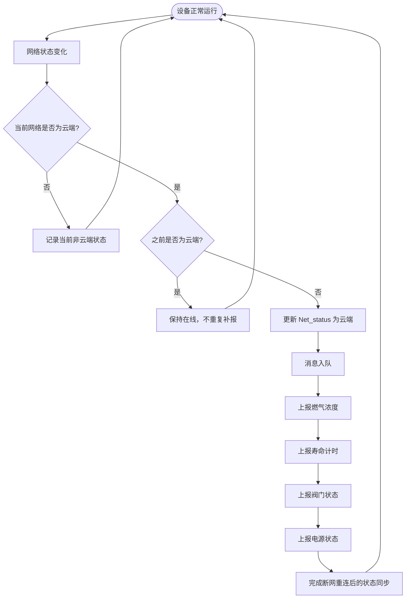

# 断网重连后数据上传流程图

```mermaid
flowchart TD
    A([设备正常运行]) --> B[网络状态变化]
    B --> C{当前网络是否为云端?}

    C -->|否| D[记录当前非云端状态]
    D --> A
    C -->|是| E{之前是否为云端?}

    E -->|是| F[保持在线，不重复补报]
    F --> A
    E -->|否| G[更新 Net_status 为云端]
    G --> H[消息入队]
    H --> I[上报燃气浓度]
    I --> J[上报寿命计时]
    J --> K[上报阀门状态]
    K --> L[上报电源状态]
    L --> M[完成断网重连后的状态同步]
    M --> A
```

断网后重新连接云端时，依次补报燃气浓度、寿命计时、阀门状态和电源状态；云端连接保持期间不重复入队。
