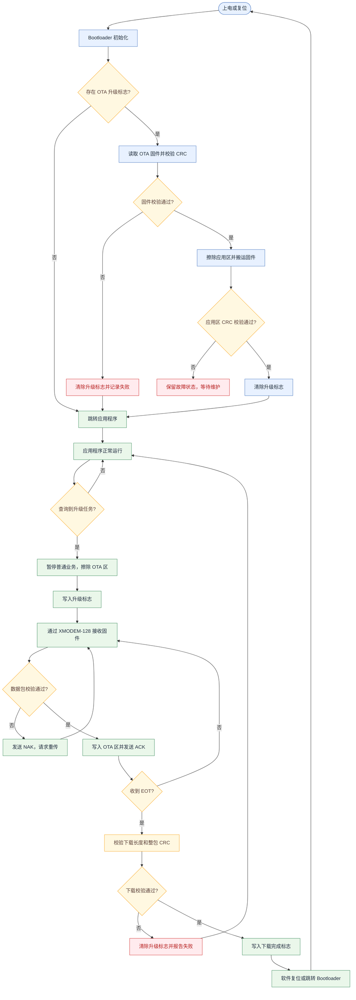

# OTA 升级流程图

```mermaid
flowchart TD
    A([上电或复位]) --> B[Bootloader 初始化]
    B --> C{存在 OTA 升级标志?}

    C -->|否| D[跳转应用程序]
    C -->|是| E[读取 OTA 固件并校验 CRC]
    E --> F{固件校验通过?}
    F -->|否| G[清除升级标志并记录失败]
    G --> D
    F -->|是| H[擦除应用区并搬运固件]
    H --> I{应用区 CRC 校验通过?}
    I -->|否| J[保留故障状态，等待维护]
    I -->|是| K[清除升级标志]
    K --> D

    D --> L[应用程序正常运行]
    L --> M{查询到升级任务?}
    M -->|否| L
    M -->|是| N[暂停普通业务，擦除 OTA 区]
    N --> O[写入升级标志]
    O --> P[通过 XMODEM-128 接收固件]
    P --> Q{数据包校验通过?}
    Q -->|否| R[发送 NAK，请求重传]
    R --> P
    Q -->|是| S[写入 OTA 区并发送 ACK]
    S --> T{收到 EOT?}
    T -->|否| P
    T -->|是| U[校验下载长度和整包 CRC]
    U --> V{下载校验通过?}
    V -->|否| W[清除升级标志并报告失败]
    W --> L
    V -->|是| X[写入下载完成标志]
    X --> Y[软件复位或跳转 Bootloader]
    Y --> A

    classDef boot fill:#e8f1ff,stroke:#4a78c2,color:#1f2d3d;
    classDef app fill:#eaf7ea,stroke:#3d8b5d,color:#1f2d3d;
    classDef check fill:#fff8e1,stroke:#f9a825,color:#5d4037;
    classDef error fill:#ffebee,stroke:#d32f2f,color:#b71c1c;

    class A,B,C,E,F,H,I,J,K boot;
    class D,L,M,N,O,P,R,S,T,U,V,X,Y app;
    class C,F,I,M,Q,T,U,V check;
    class G,J,W error;
```

- Bootloader 启动时检查升级标志，完成固件搬运并校验后进入应用程序。
- 应用程序通过 XMODEM-128 接收固件；下载完成后复位，重新进入 Bootloader。
